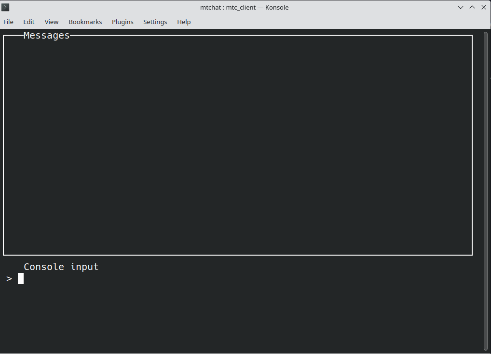

# Messagerie

## Squelette de code

Le code dans le répertoire contient les fichiers suivants :

-   `mtc_client.c` : le code du programme client ;
-   `mtc_server.c` : le code du programme serveur ;
-   `console.c` et `console.h` : le code pour l'interface du terminal du client ;
-   `protocol.h` : la spécification des messages échangés entre clients et serveur ;
-   `utils.h` : des fonctions et macros auxiliaires ; 
-   `Makefile` : le makefile.

Pour compiler les deux programmes, il suffit de lancer `make`. Pour exécuter le serveur, saisissez dans un terminal la commande

    ./mtc_server <port_number>

où `port_number` est un numéro de port, par exemple `8008`. Si vous voulez un log de tous les messages du serveur, ajoutez l'option `-v` (*verbose*) :

    ./mtc_server -v <port_number>

Pour lancer le client, dans un autre terminal saisissez la commande suivante :

    ./mtc_client <host_name> <port_number> <pseudo>

où `host_name` est l'adresse IPv4 du serveur. Si le client est lancé sur le même ordinateur que le serveur, il suffit de spécifier `localhost`. Le `port_number` doit être le même que celui indiqué pour le serveur. Le `pseudo` est le nom d'affichage de ce client.

Si tout fonctionne correctement, vous verrez sur l'écran l'image suivante :

